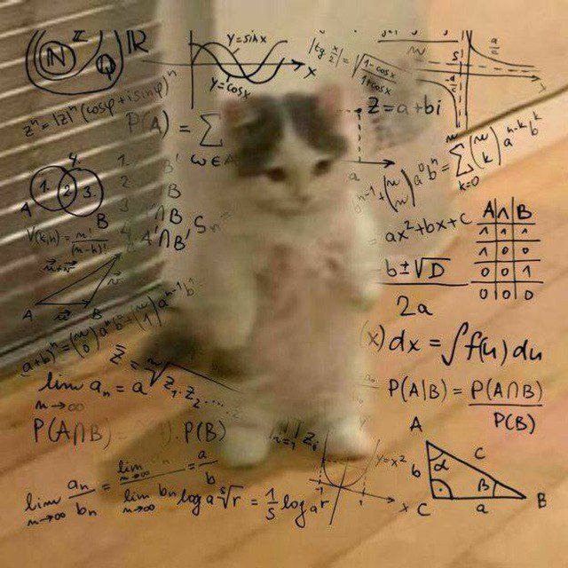
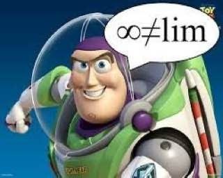
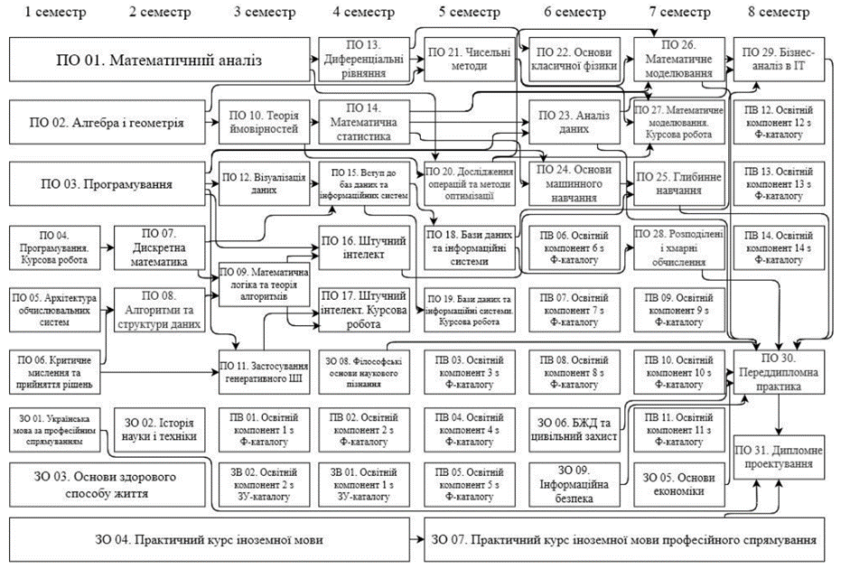
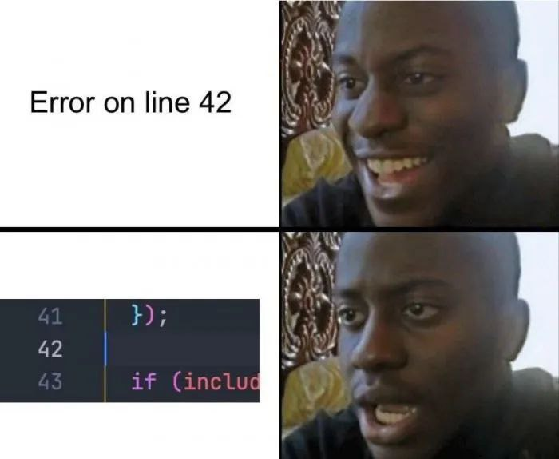
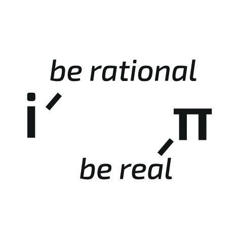

# Гайд на 113

## Вступ
[Освітня програма: “Наука про дані (Data Science) та математичне моделювання”](https://pma.fpm.kpi.ua/_next/static/media/uploads-bld-node-01-a2dcf20c-39d8-4a99-a0d3-ee4b923069c6.pdf)

Зміст діяльності фахівців зі спеціальності ПРИКЛАДНА МАТЕМАТИКА полягає у математичному моделюванні та комп’ютерній імітації складних технічних/економічних/ біологічних систем, процесів та явищ, розробленні нових чи адаптації існуючих математичних методів і алгоритмів обробки даних різної природи, створенні математичного та програмного забезпечення систем обробки інформації, розробленні систем штучного інтелекту, Data Mining та Soft Computing.

## Ким я буду?

Це питання, яке хвилює всіх абітурієнтів, що стоять перед вибором майбутньої професії та знаходяться в оточенні купи незрозумілих спеціальностей.

Отже, грубо кажучи, *Прикладний математик — Data scientist*. Також, випускники за даною спеціальністю мають змогу працювати  в наступних напрямках: Machine learning engineer, Data engineer, Data analyst, Business analyst, тощо.

Варто зазначити, що як і всюди, просто провчитись тут буде недостатньо для працевлаштування. Ви можете отримати потужну базу, проте без самопідготовки абсолютно ніяк. 

## Кому варто сюди йти?

Обмежень чи рекомендацій ми Вам не дамо, проте можемо трохи розповісти загальне. 

Математики, а саме її різновиду, буде багато. Також буде блок програмістських дисциплін, тобто будете вивчати різні мови програмування, різні парадигми та як їх поєднати з математичною базою ([детальніше на сайті кафедри](https://pma.fpm.kpi.ua/uk)). Щодо цього, то за програмою передбачено навчання з нуля. Тобто якщо Ви взагалі не маєте досвіду в програмуванні  - це не буде великою проблемою.

## Чи зможу стати вчителем математики після? 
Так, відносно недавно був прийнятий закон, за яким IT-спеціалісти можуть бути інтернами з математики та інформатики у школах. Але слід зазначити,  що якщо це ваша основна ціль, то можливо варто звернути увагу на спеціальності 014 Середня освіта та 111 Математика...

## Я буду програмістом?
Хочемо наголосити,  що  якщо ви хочете бути чистим «кодером», то у нас для вас забагато математики і можливо недостатньо програмування, бо ми використовуємо його більше, як інструмент для математики. Також якщо під час навчання звернете увагу на «базові предмети для програмування» та будете займатись самоосвітою, то знання математики вигідно вас виділить на фоні конкурентів у майбутньому. 

У нас є студенти та випускники, що працюють  Back End/Full Stack розробниками, тож все можливо лише за вашого бажання і наснаги)

## Що є на 113 ФПМ? (предмети та програма)
За [програмою](https://pma.fpm.kpi.ua/_next/static/media/uploads-bld-node-01-a2dcf20c-39d8-4a99-a0d3-ee4b923069c6.pdf) ви будете вивчати наступні предмети:

*Зараз наша освітня програма проходить оновлення. Тому розповідати про предмети на 113  ми поки не будемо, а лише надамо узагальнену характеристику програми.*

Узагальнюючи,  предмети можна розділити на 3 блоки: математичні,  програмуванням та гуманітарні:

+ **Математики** буде багато і ви будете прискіпливо вивчати багато напрямків, але навіть тих, хто не був захоплений царицею наук, після першого семестру захоплює цей світ законів і формул.  Окремо варто виділити викладачів, що максимально йдуть на зустріч і іноді пояснюють по 10 разів, якщо є необхідність.  Тут не буде, що вас просто скажуть, що це вже треба було знати.  Натомість швидше дадуть пояснення і додаткові матеріали, де розкривається тема, що зацікавила.

+ На **програмуванні** знайомлять з різними мовами та парадигмами, але не роблять акценту на глибокому вивченні якоїсь з мов. Також вивчаються предмети, що необхідні для всіх у ІТ, такі як Алгоритми і структури даних, Архітектура обчислювальних систем та інші. Серед викладачів є чинні спеціалісти,  що дають найактуальніші знання.

+ Викладання **гуманітарних** дисциплін мало чим відрізняється від викладання на інших технічних спеціальностях. Але слід зазначити, що всі вже знайомі предмети зі школи отримують приписку «за професійним спрямуванням». Тож замість «Історії» буде «Історія науки і техніки», на «Укр.мові» протягом семестру вас будуть вчити складати документацію та спілкуватись у професійному середовищі  і т.п. 

## Прохідний бал
Трохи статистики за минулі роки:

*Проте ніхто достовірно не знає, як буде в новому році, тому не варто. Всі цифри це статистика, не оцінка якості чи престижності факультету і тим паче спеціальності.*

## Чим відрізняється 113 від 111/124

Всі три спеціальності мають однаковий математичний апарат, відповідно і фундамент освітніх програм схожий, але відмінності все таки є: 

+ [111](https://fmf.kpi.ua/vstup-na-bakalavrat/) більш напрямлена в сторону економічної сфери (страхова та фінансова математика), тобто на виході ви зможете з впевненістю піти в банківську або страхову сферу
+ [124](https://iasa.kpi.ua/bachelor-admission) спрямована на аналіз та моделювання даних, тут буде більше фізики та праці з базами даних ніж на 113, на виході станете гарними системними аналітиками
+ [113](https://pma.fpm.kpi.ua/uk/vstup/vstup-na-pershiy-kurs) дають більш широкі знання з програмування, є предмети спрямовані на штучний інтелект та його навчання, робота з даними. Можете стати більш різноплановим програмістом, та звичайно ж зануритися у світ Data science.

## Чим відрізняється 113 ФПМ від 113 ФТІ

На ФТІ також є 113-та спеціальність, проте в них представлені дві інші освітні програми:

"Математичні методи моделювання, розпізнавання образів та комп'ютерного зору" ([кафедра ММАД](https://mmda.ipt.kpi.ua/)) та "Математичні методи криптографічного захисту інформації" ([кафедра ММЗІ](https://mmis.ipt.kpi.ua/)).

Математична база в них мало чим відрізняється, програмування вивчають також.

Відмінність заключається у використанні отриманого математичного апарату: 

+ Перша програма фокусується на аналізі даних та задачах машинного зору. 
+ Друга спеціалізується на криптології та необхідних для цього математичних дисциплін.
+ В свою чергу на **113 ФПМ** вас чекає праця зі штучним інтелектом, Machine learning та дорога до Data science.
Тож результат вибору тут залежить лише від того, що вам ближче до душі: комп’ютерний зір, крипта чи ШІ та Data science - що більше цікавить, туди і йдете ;)

*Також варто зазначити, що при поданні заявки на вступ, 113 від ФПМ та від ФТІ вважаються як дві різні заявки*

## Відгуки студентів/випускників

+ Зі свого досвіду: “дуже часто, коли виникали труднощі з темою, я отримувала швидкий фідбек від викладачів з допомогою. Деякі навіть наполягають писати їм, якщо щось незрозуміло. Отже, воно то важкувато може бути, але ресурс, щоб впоратися зі складнощами завжди поруч”

+ “При вступі хотів вчити математику, але щоб це була не просто теорія  заради теорії, а ще й мало якесь використання. Для цього бачив два шляхи - піти в фізику або в програмування. В ході пошуку знайшов 113 спецу і вона цілком задовольнила мої бажання. Також було інше побоювання - “чи достатньо буде математики?” - так, цілком достатньо). По суті ви вчите те саме, що й звичайні математики, проте десь можуть сприйняти теорему без доведення, бо це б зайняло занадто багато часу, а профіту з цього для нас мало.”

+ “У мене було дуже багато очікувань, коли я вступав на 113. Мені казали що тут багато можливостей, академічна мобільність, круті люди і тд... Я вчився у філологічному ліцеї, тому були сумніви, чи потягну математику, адже знань профільної математики у мене не було.  Закінчивши перший курс, можу сказати що всі очікування виправдані, але треба було дуже потужно і багато працювати. Було витрачено дуже багато часу та нервів на самонавчання, самоорганізацію, але воно було того варто!”

+ Будучи абітурієнткою я дуже не хотіла йти в програмування, тому і шукала спеціальність, де його небагато. Провчившись 2 курси скажу, що очікування виправдались, мені подобається, як викладають та те, що ми використовуємо програмування як інструмент. Про математику: 100 з 10. Викладання неймовірне))) Наприклад, теорію ймовірностей на такому рівні викладають тільки можливо в KSE. Ще дуже важливим для мене було потрапити в гарну студентську спільноту, і тут теж ставка зіграла.

+ Чесно кажучи, спеціальність я обрала майже випадково: горіла математикою, але боялася програмування, тому думала, що ІТ не для мене. Завершивши 2 курси можу зробити підсумок, що математика - краще, що придумали люди, а програмування зараз мені навіть подобається завдяки подачі у викладанні та можливості спростити собі роботу. Рекомендую, 113 - це круто ;)

---

    Дякуємо за увагу і сподіваємось цей гайд допоміг трохи більше зрозуміти куди все ж прикладати ту математику;)

    З любов'ю, СР ФПМ

    ☆*: .｡. o(≧▽≦)o

---
Якщо залишились питання, писати [сюди](https://t.me/fam_abit)^_^